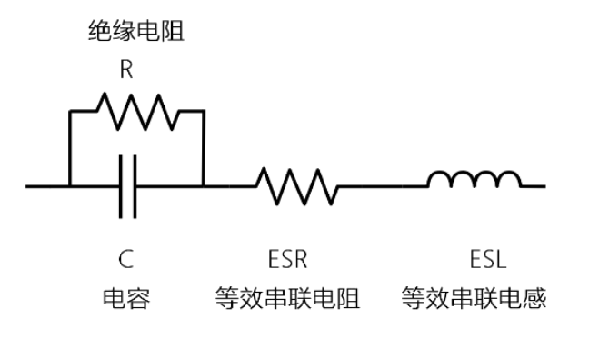
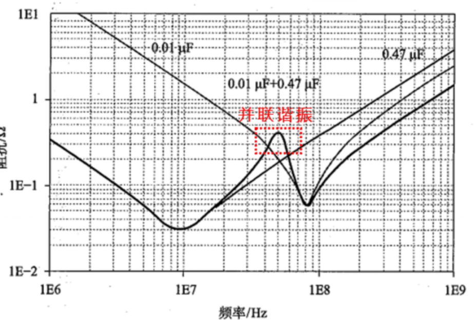
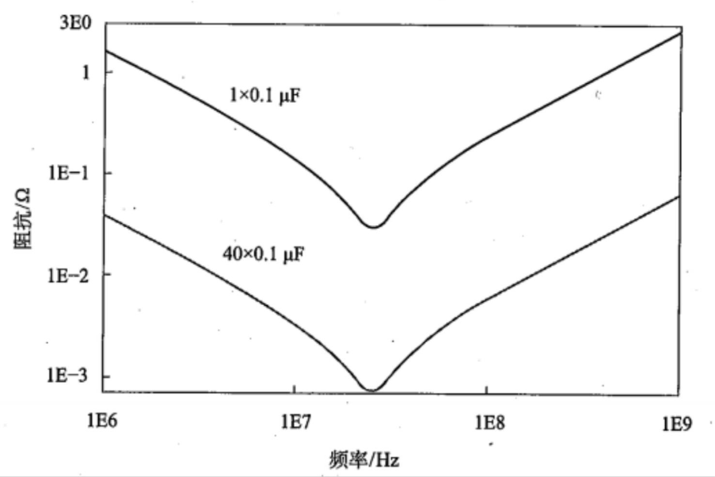
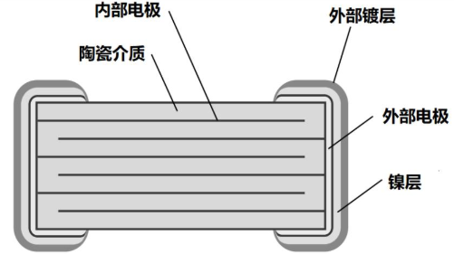
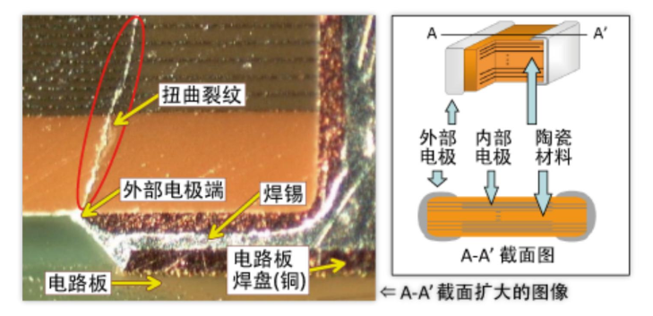
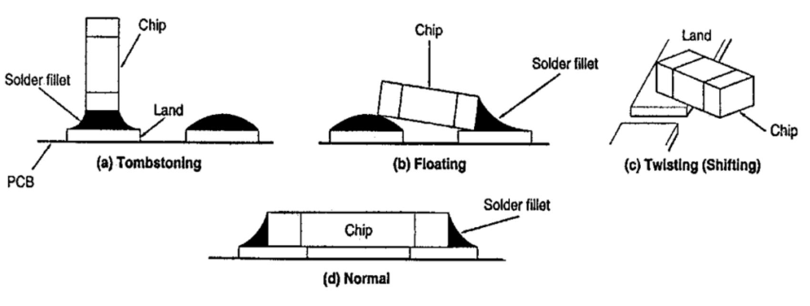
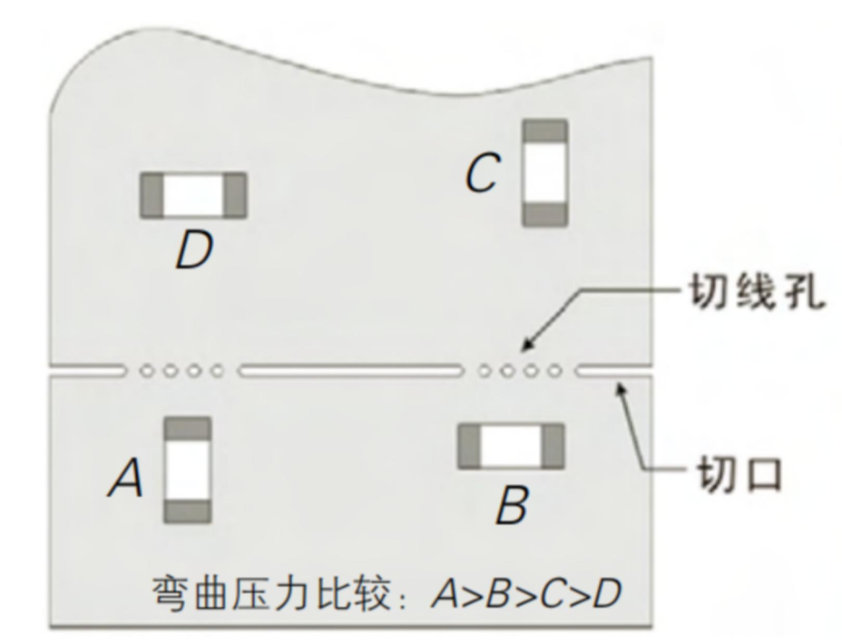

# Read The Fucking Book

在开始之前先快速进行下列知识的扫盲，然后在日后学习和实践中遇到的相关经验教训也会记录在这里

## 电阻

电阻阻值是离散的，并不是所有阻值的电阻都有生产，要根据需求进行选择
- 电阻的标称阻值有 `Ex` 一共六大系列，表示误差的精度等级
- 其中以 `E24` 和 `E96` 两个系列为最常用
- 电阻温度系数 $\displaystyle TCR$ 表示电阻当温度改变 1 摄氏度时，电阻值的相对变化，单位为 $\displaystyle ppm/℃$，其中 $ppm$（part per million）表示百万分之几

电阻封装的命名是根据电阻的实际尺寸来的英寸单位
- 目前一般电子产品主要用 `0402`，`0603` 封装的，要求功率高点的用 `1206` 的，手机或者穿戴设备会用到更小封装，比如 `01005`，`0201` 等

电阻的额定功率主要由封装决定，但也不是绝对的，还跟电阻的工艺（薄膜还是厚膜），品牌，阻值大小、温度等有一定关系
- 如果上网查功率与封装的关系的话，会有一些功率与封装表格，那并不一定总是正确的
- 同一封装，品牌、精度、阻值的其中一个变量的改变都可能让电阻功率不同
- 需要注意的是，一般电阻的额定功率表格是在 $70℃$ 条件测量的，如果温度超过 $70℃$，其额定功率是会下降的

电阻是有额定耐压值的，不能超过额定耐压值使用
- 材质相同（厚膜）的额定电压，各品牌相差不大
- 材质不同，额定电压有差别，薄膜要比厚膜要低
- 封装越大，额定电压升高

## $\displaystyle 0\Omega$ 电阻相关

$\displaystyle 0\Omega$ 电阻的作用
- 方便测试电流
- 兼容设计，跳线 
- 模拟地，数字地分开，单点接地
- 占个位置（可换成其它阻值的电阻，也可换成磁珠）
- 做电路保护，充当低成本熔丝

$0\Omega$ 电阻实际最大阻值 $\displaystyle 10m\Omega$，$\displaystyle 20m\Omega$，$\displaystyle 50 m\Omega$ 可选，需要实际查询各个厂家
- 需要注意的是，不同厂家、不同封装 $\displaystyle 0\Omega$ 电阻的过流能力并不相同
- 常规的 $\displaystyle 0\Omega$ 电阻的电流都不大，按照综合后的最小值，最大的也就 $2A$
- 如果设计电路时发现要用 $3A$ 或 $4A$ 的 $\displaystyle 0\Omega$ 电阻，**可以用 2 个 $\displaystyle 0\Omega$ 电阻并联起来就行了**

## 实际电容模型

两个相互靠近的导体，中间夹一层不导电的绝缘介质，这就构成了理想电容。当电容的两个极板之间加上电压时，电容就会储存电荷，其中电容容量的公式为 $\displaystyle C=\frac{\varepsilon_{r}S}{4\pi kd}$ 

电容的基本单位为法 $\displaystyle F$，但是由于 $\displaystyle F$ 非常大，所以看到的一般都是 $μF$、$nF$、$pF$ 的单位，而不是 $F$ 的单位

但是实际生产的电容都不是理想的，会有寄生电感，等效串联电阻存在，同时因为电容两极板间的介质不是绝对绝缘的，因此存在数值较大的绝缘电阻，所以电容的实际模型如下：

因此根据这个模型，就可以得到电容的复阻抗公式
$$
\displaystyle Z=R_{ESR}+j\omega L_{ESL}+\frac{R· \frac{1}{j\omega C}}{R+\frac{1}{j\omega C}}
$$
实际上因为绝缘电阻 $\displaystyle R$ 远远大于 $\displaystyle \frac{1}{j\omega C}$ 所以公式可以简化为
$$
Z=R_{ESR}+\frac{1}{j\omega C}+j\omega L_{ESR}
$$

也就是说实际的所谓电容在电路中是有容抗、感抗、和等效串联电阻的
- 很容易看出，在频率比较低的时候，容抗远大于感抗，电容主要成容性，在频率比较高的时候，电容主要呈感性
- 当 $\displaystyle \omega=\frac{1}{\sqrt{ LC }}$，即谐振的时候，阻抗等于等效串联电阻，此时阻抗达到最小值，在电容上产生的电压波动就小，也就是噪声会小。如果是用来滤波去耦的话，此时效果最好，可以过滤出这个频率的信号（可以在手册中查看阻抗频率曲线，一般容量大的谐振点在低频，容量小的谐振点在高频）
- 实际上，，陶瓷电容的等效串联电阻 $\displaystyle R_{ESR}$ 并不是恒定的，它是跟频率有很大的关系。这个参数其实特别重要，比如用在开关电源的时候，需要用来计算纹波的大小（可以在手册中查看 $\displaystyle ESR$ 频率曲线）

使用两种方式组合滤波，实际电路中需要去耦的频率范围会比较宽，因此如果一个电容搞不定时就有两种方法来解决，**一种是使用一个大电容和一个小电容并联，还有一种是使用多个相同的电容并联**
- 如果使用一个大电容和一个小电容并联，会有一段频率区间是大电容呈感性、小电容呈容性，两者并联，就像是一个电感和一个电容并联，构成了 LC 并联谐振电路，并在某一个频率点发生并联谐振，导致该处阻抗很大，如果负载芯片的电流需求正好落在这个频率，那么会导致电压波动超标，这种情况需要避免
	
- $\displaystyle N$ 个相同的电容并联，谐振频率和单个电容一样，但是在谐振点处的阻抗是原来的 $\displaystyle N$ 分之一，因此，多个相同的电容并联后，阻抗曲线整体形状不变，但是各个频点的整体阻抗变小
	

## 陶瓷电容

这里最常见的电容就是 $MLCC$（Multi-layer Ceramic Capacitors）陶瓷电容

陶瓷电容是由印好内电极的陶瓷介质膜片以错位的方式叠合起来，经过一次性高温烧结形成陶瓷芯片，再在芯片的两端封上金属层（外电极），从而形成一个类似独石的结构体，故也叫独石电容器

这里内部电极通过一层层叠起来，又由于错位，所以这么多内部电极实际上只被划分为两个不同的阵营连接到外部极板，从而达到增大电容两极板的等效面积效果，从而增大电容量

实际上陶瓷电容的容量也是离散的，有精度误差区别的，根据封装尺寸的不同，容量也会不同
- 常用陶瓷电容容量范围是 $0.5pF\sim100\mu F$
- 一般推荐 `0402` 选 $4.7uF/6.3V$，`0603` 选 $22uF/6.3 V$，`0805` 选 $47uF/6.3V$，其它更高耐压需要对应降低容量

一般电容额定的电压值与电容的两极板间的距离有关系，额定电压越大，一般距离就要更大，否则介质会被击穿。因此对于陶瓷电容来说，这就导致了同等容量的电容，**耐压值高的，一般尺寸会更大**
> 电容器的外加电压不得超过规范中规定的额定电压，实际在电路设计中，一般选用电容时，都会**让额定电压留有大概 $70\%$ 的裕量**

同介质种类的 $MLCC$ 陶瓷电容由于它的主要极化类型不一样，其对电场变化的响应速度和极化率亦不一样。在相同的体积下的容量就不同，随之带来的电容器的介质损耗、容量稳定性等也就不同。介质材料划按容量的温度稳定性可以分为两类，即 Ⅰ 类陶瓷电容器（高介电常数型）和 Ⅱ 类陶瓷电容器（温度补偿型）
- 高介电常数的容量大，相对介电常数会随温度、电压的变化，导致容量也会发生变化
- 温度补偿型的容量小，相对介电常数不会随温度、电压的变化，容量基本稳定

不同类型的陶瓷电容的工作温度范围是不同的、并且其容量随温度的变化也不同，相差非常大，可以查手册获得，在设计电路的时候，需要考虑不同电容的温度系数，按照使用场景选择符合要求的电容。在一些对电容容量由要求的地方，就不能选择 Y 或者 Z 系列的电容

陶瓷电容的另外一个特性是其直流偏压特性，如果施加直流电压，其静电容量有时会不同于标称值，因此应特别注意，比如**高介电常数电容器施加的直流电压越大，其实际静电容量越低**

陶瓷电容绝缘电阻 $\displaystyle R$ 比较大，漏电流就小，它主要与容量有关，容量越大，漏电流越大

陶瓷电容在施加交流电压时也会有啸叫现象

## 贴片元件机械应力处理

这里以贴片陶瓷电容为例进行讲解，陶瓷电容最坑的失效就是短路了，**机械应力会产生裂纹，从而是电容容量变小或者是短路**

为什么会产生扭曲裂纹呢？这是由于贴片是焊接在电路板上的。对电路板施加过大的机械力、使得电路板弯曲或老化，从而产生了扭曲裂纹

一般贴片元件的封装越大，越容易产生机械应力失效，常出现应力的场景是
- 贴片机拾取电容力度过大，施力点不在中心，电容不平都可能碰坏电容
- 当温度变化时，**过度的焊锡**在贴片电容器上面产生很高的张力，从而是电容器断裂，裂纹一般发生在焊锡少的一侧；焊锡不足时又会使电容器从 PCB 上剥离
- 焊接到 PCB 板上后，PCB 弯曲，拉动瓷片电容，过应力后损坏
- PCB/成品跌落导致振动或变形，使电容受到机械应力
- 突然加热或冷却导致张力比较大（解决办法是先预热
- 在回流焊过程中，贴片元件两端电极受到焊锡融化后的表面张力不平衡会产生转动力矩，将元件一端拉偏形成虚焊，转动力矩较大时元件一端会被拉起，形成墓碑效应
	

一般的贴片元件出现问题的原因是两端电极尺寸差异较大；锡镀层不均匀，PCB 板焊盘大小不等、有污物或水分、氧化以及焊盘有埋孔，锡膏粘度过高，锡粉氧化，相应的措施有
- PCB 设计时贴片元件需要远离螺丝孔、减小应力
- PCB 设计时贴片元件放置方向平行于 PCB 弯曲方向，放置在远离 PCB 大形变的位置，避免它在长边受力
	
- PCB 设计时考虑电路板的弯曲量和各个元件能承受的弯曲量，比较重的元器件尽量均匀摆放，减少生产过程中由于重力造成的板弯曲
- 焊接之前对 PCB 板进行清洗烘干，去除表面污物及水分
- 进行焊前检查，确认左右焊盘尺寸相同
- 锡膏放置时间不能过长，焊接前需进行充分的搅拌
- 测试时合理使用支撑架，避免板受力弯曲
- 手工焊接前，应增加焊接前的预热工序，手工焊接全过程中禁止烙铁头直接接触电容电极或本体。复焊应在焊点冷却后进行，次数不得超过 2 次

## 铝电解电容

静电容量会受温度和频率影响
- 温度升高，容量也会升高；温度降低，容量也会降低
- 频率越高，容量越小；频率越低，容量越大

普通铝电解电容在规格书中都是找不到串联等效电阻 $\displaystyle R_{ESR}$ 的值，但是有损耗角损耗角参数，这里是根据之前的实际电容等效模型，进一步定义一个参数损耗角 $\displaystyle \delta$，满足 $$\displaystyle \tan \delta=\frac{R}{\frac{1}{\omega C}}$$ 然后就不直接描述 $\displaystyle R_{ESR}$ 了，而是使用 $\displaystyle \delta$ 来指代串联等效电阻的大小

漏电流是铝电解电容器特性之一，当施加直流电压时，电介质氧化层允许很小的电流通过，这一部分小电流称为漏电流
> 理想的电容器是不会产生漏电流的情况（和充电电流不一样，即使电压恒定，这个电流也是持续存在的）

漏电流会随时间而减小后会达到一个稳定值。因此漏电流的规格值为 $20℃$ 下施加额定电压一段时间之后所测量的值。当温度升高时，漏电流增加；温度降低，漏电流减少；施加的电压降低，漏电流值也会减少

对于串联等效电阻 $\displaystyle ESR$，在低频率区间，有频率依存性的电介质损失影响大，因而 $\displaystyle R_{ESR}$ 曲线向下。在高频区间，电解液和电解纸的阻值占主导地位，不再受频率的影响，因而 $\displaystyle R_{ESR}$ 值趋于稳定
> 额定电压越大，容量越大，$\displaystyle R_{ESR}$ 越小

不同于 $MLCC$ 陶瓷电容，铝电解电容需要注意额定纹波电流，它是有效值，不能超规格使用。之所以有这个指标是因为铝电解电容的串联等效电阻相对比较大，因此，如果纹波电流比较大的话，内部发热严重，就会导致电容器失效。额定纹波电流与封装大小和 $\displaystyle R_{ESR}$ 有关系
> $\displaystyle R_{ESR}$ 越小，封装越大，额定纹波电流越大

对于铝电解电容，工作温度每升高 $10℃$，寿命减小一倍

安规电容是在失效后不是短路状态的电容，分为 $\displaystyle X$ 电容和 $\displaystyle Y$ 电容，主要用于强电
- $\displaystyle X$ 电容是跨接在零线和火线之间的电容，主要用于差模滤波
- $\displaystyle Y$ 电容是零线与地之间的电容，火线与地之间的电容，主要用于共模滤波

## 电感
## $\displaystyle MOS$ 管

